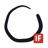
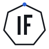
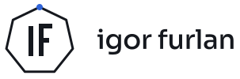
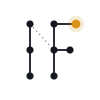
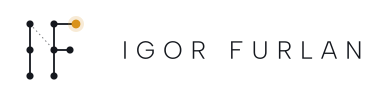
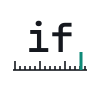
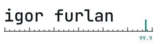

# Marks

Logo directions for my profile. Each comes as a square mark and a lockup with my name, in light and dark versions. Text is converted to outlines, so the files don't need any fonts installed.

## Ensō and seal

An open single-stroke circle with a red IF seal. In use on my profile.

<picture><source media="(prefers-color-scheme: dark)" srcset="enso-mark-dark.svg"></picture> &nbsp;&nbsp; <picture><source media="(prefers-color-scheme: dark)" srcset="enso-lockup-dark.svg"></picture>

## Heptagon monogram

I and F inside a seven-sided frame, the shape of the Kubernetes wheel.

<picture><source media="(prefers-color-scheme: dark)" srcset="heptagon-mark-dark.svg"></picture> &nbsp;&nbsp; <picture><source media="(prefers-color-scheme: dark)" srcset="heptagon-lockup-dark.svg"></picture>

## Constellation

I and F drawn as nodes and edges, with one amber star.

<picture><source media="(prefers-color-scheme: dark)" srcset="constellation-mark-dark.svg"></picture> &nbsp;&nbsp; <picture><source media="(prefers-color-scheme: dark)" srcset="constellation-lockup-dark.svg"></picture>

## Error budget

A monospace wordmark over a measuring scale, with a tick at 99.9.

<picture><source media="(prefers-color-scheme: dark)" srcset="ruler-mark-dark.svg"></picture> &nbsp;&nbsp; <picture><source media="(prefers-color-scheme: dark)" srcset="ruler-lockup-dark.svg"></picture>

